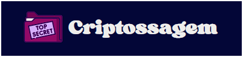
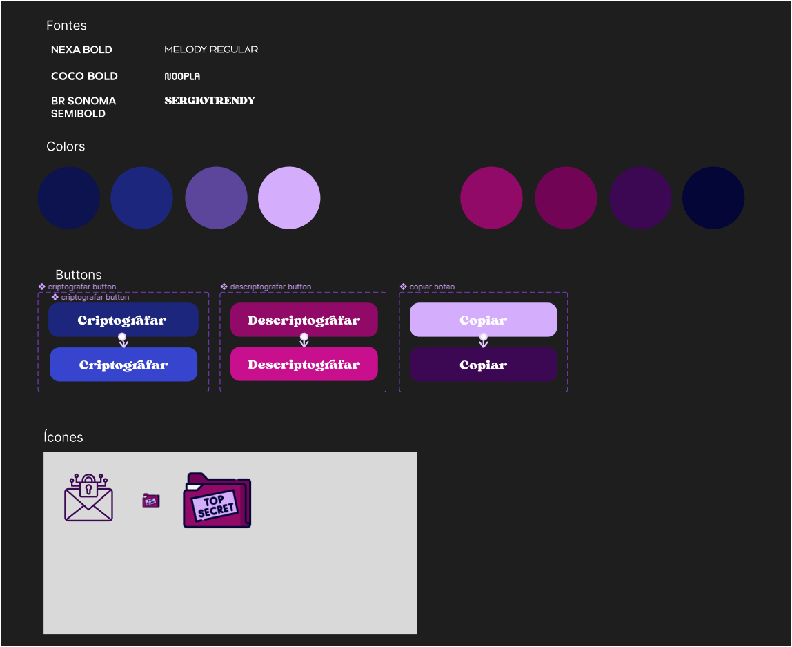

<h1 align="center">

Message Encoder

</h1>

## 📑 About
**Criptossagem** is a project developed in the first phase of the ONE Program, which consists of creating a website that has the functionality to encode and decode the vowels of words entered in the text field, outputting the result on the screen, in addition to the copy button.

## 🛠️ Tools

## 🎨 Figma

Although it was challenging to have a standard layout for creating the decoder, I decided to create the layout myself in Figma. Below are the components I used to create the website design.

#challengeonedecodificador5
